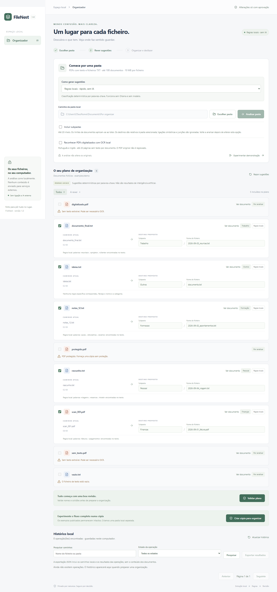
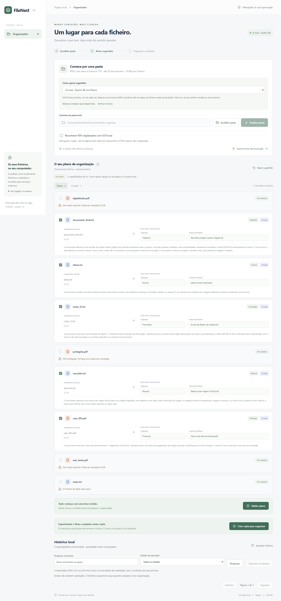
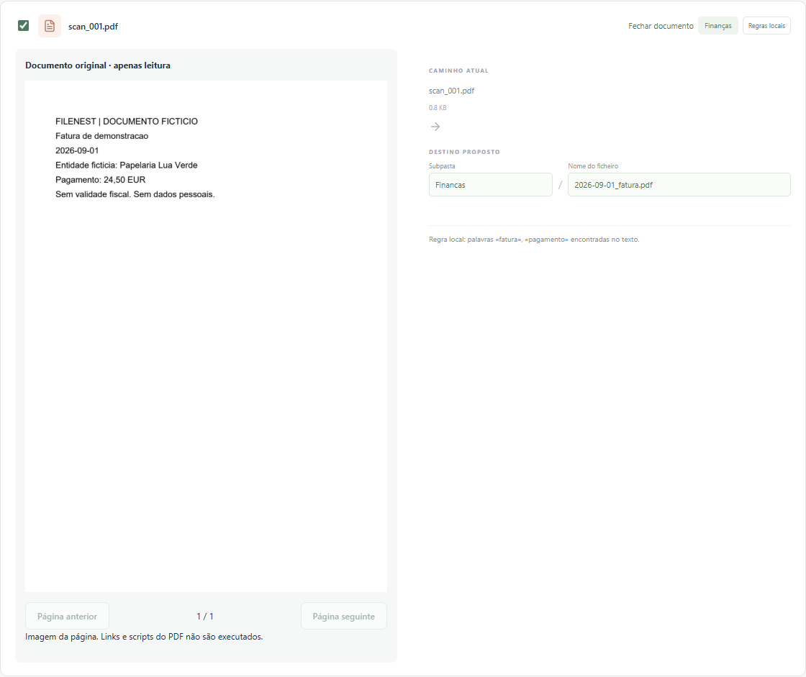

# FileNest

**Um lugar para cada ficheiro.** Organizador local que lê documentos e propõe nomes e subpastas, com revisão antes de qualquer alteração.

Projeto de portefólio de Engenharia Informática. A versão **1.0** implementa análise por **regras ou IA local**, revisão, organização com aprovação explícita, histórico e desfazer. A IA opcional usa Qwen3 4B através do Ollama no próprio computador. Analisar e validar não alteram os documentos; organizar muda os caminhos apenas depois da confirmação final. Nenhum documento é enviado para serviços externos.



## Executar no Windows

Requisitos: Python **3.11+**, Node.js **22.12+** e npm. Verificado com Python 3.14 e Node 25. A instalação inicial das dependências requer Internet; a aplicação não requer serviços externos.

Abra o PowerShell na raiz do repositório.

**Terminal 1 — API:**

```powershell
py -m venv .venv
.\.venv\Scripts\python -m pip install -r backend/requirements-lock.txt
.\.venv\Scripts\python -m uvicorn backend.main:app --host 127.0.0.1 --port 8000
```

Não precisa de ativar o ambiente virtual nem alterar a política de execução do PowerShell. Se `py` não existir, use `python` no primeiro comando.

**Terminal 2 — interface, também a partir da raiz:**

```powershell
cd frontend
npm ci
npm run dev
```

Abra [FileNest local](http://127.0.0.1:5173). Pare com `Ctrl+C` em cada terminal. As portas 8000 e 5173 têm de estar disponíveis. Os servidores destinam-se a uso local individual; não os exponha na rede.

Se tinha uma versão anterior aberta, atualize as dependências Python com o comando acima, **reinicie o backend** e atualize a página. Não precisa do SDK Python do Ollama.

## OCR local opcional

Depois de instalar as dependências Python, execute na raiz:

```powershell
powershell -ExecutionPolicy Bypass -File scripts/setup_ocr.ps1
```

O script instala Tesseract via winget se necessário e descarrega português e inglês para `.filenest/tessdata`, ignorado pelo Git. Só a instalação requer Internet; nenhum documento é enviado. Ative **Reconhecer PDFs digitalizados com OCR local** e volte a analisar. `digitalizado.pdf` contém uma imagem fictícia que passa a ser legível com OCR. `sem_texto.pdf` é uma página vazia e continua sem conteúdo reconhecível.

PDFs mistos mantêm o texto existente e reconhecem apenas páginas sem texto. Imagens temporárias são removidas após a extração; os PDFs originais não são regravados. Instalações personalizadas podem definir `FILENEST_TESSERACT` (executável) e `FILENEST_TESSDATA` (diretório com `por.traineddata` e `eng.traineddata`).

## IA local opcional: instalação simples

O modo **Regras locais** continua a funcionar sem instalar modelos. Para ativar a IA:

1. Instale ou abra o [Ollama para Windows](https://ollama.com/download/windows).
2. Num terminal novo, descarregue o modelo uma vez:

```powershell
ollama pull qwen3:4b
```

Se `ollama` não for reconhecido e tiver usado o instalador padrão do Windows:

```powershell
& "$env:LOCALAPPDATA\Programs\Ollama\ollama.exe" pull qwen3:4b
```

3. Deixe o Ollama em execução. No FileNest, escolha **IA local · Qwen3 4B via Ollama**, clique em **Verificar Ollama** e analise a pasta ou a demonstração.

O download do modelo requer Internet e ocupa cerca de 2,5 GB; a inferência é local. A aplicação comunica apenas com `127.0.0.1:11434`, usa o modelo fixo `qwen3:4b` e recusa aliases cloud detetados. Não configura serviços pagos, contas, Docker ou WSL. [Modelo oficial](https://ollama.com/library/qwen3:4b) · [Documentação Ollama para Windows](https://docs.ollama.com/windows).

Se o serviço ou modelo faltar, a interface explica o problema e permite escolher regras. Se a IA falhar durante uma análise, os documentos restantes usam regras; a origem e o motivo são mostrados em cada resultado. Nunca são apresentados resultados de regras como se fossem IA.



## Demonstração em dois minutos

Depois da análise, clique em **Ver documento** para consultar o original ao lado das sugestões. Pode editar nomes e subpastas com a pré-visualização aberta. Os PDFs têm navegação por páginas; os TXT aparecem como texto simples.



1. Clique em **Experimentar demonstração**. Não precisa de chave de API.
2. Observe `scan_001.pdf` → `Financas/2026-09-01_fatura.pdf`, a partir do texto fictício.
3. Edite um nome ou subpasta e clique em **Validar plano**.
4. Experimente `../fora` como subpasta: o destino é assinalado como inválido.
5. Desmarque documentos para os excluir. **Repor sugestões** recupera o resultado inicial.
6. Explore **A rever** para ver o PDF protegido, o PDF sem texto e o TXT vazio.
7. Clique em **Criar cópia para organizar**. Será criada uma pasta separada em `.filenest/demos`; os exemplos do Git permanecem intactos.
8. Clique em **Preparar organização**, reveja a lista, assinale a autorização e escolha **Confirmar e organizar**.
9. No **Histórico local**, escolha **Desfazer**, confirme o restauro e verifique os caminhos originais. O histórico mantém-se depois de atualizar a página ou reiniciar a API.

As edições existem apenas na memória da página e perdem-se ao atualizar ou analisar outra pasta. Validar não guarda nem executa o plano. Preparar guarda uma cópia exata da revisão final no histórico, mas ainda não move ficheiros. Cancelar a confirmação deixa esse registo como «Preparado · não executado».

Para documentos próprios, use **Escolher pasta** ou introduza um caminho absoluto sem aspas, como `C:\Users\OSeuNome\Documents\Por organizar`. Prefira uma pasta fora do repositório para não adicionar documentos pessoais ao Git. Veja também o [guião de apresentação](docs/demo.md).

## Implementado

- Pré-visualização de TXT e páginas PDF ao lado das sugestões, incluindo PDFs digitalizados sem OCR. Navegação por páginas e edição das sugestões sem sair da aplicação.

- Progresso por documento e cancelamento da análise, conservando resultados concluídos.

- Seletor nativo de pastas, com introdução manual alternativa.
- Opção **Incluir subpastas**, com caminhos de origem completos na revisão e no restauro.
- PDFs com texto e TXT UTF-8, incluindo BOM; OCR local opcional para páginas digitalizadas.
- Extração em processos separados com limites de tempo e memória.
- Histórico pesquisável, paginado e exportável em JSON.
- Categoria, nome atual, nome proposto, subpasta e justificação por documento.
- Edição de nomes e subpastas, exclusão e reposição das sugestões.
- Validação de nomes Windows, extensões, caminhos e colisões entre propostas e destinos existentes, incluindo conflitos ficheiro/pasta.
- Estados de carregamento, pasta vazia, caminho inválido, falta de acesso, servidor indisponível e erros individuais de extração.
- Identificação de PDFs protegidos e PDFs sem texto que podem necessitar de OCR.
- Interface responsiva em português de Portugal, com comparação origem/destino.
- Demonstração fictícia sem API, identificada explicitamente como regras locais.
- Fornecedor opcional Qwen3 4B com saída JSON estruturada, verificação independente e identificação da origem por ficheiro.
- Verificação do serviço/modelo local e alternativa por regras visível em caso de falha durante a análise.
- Aprovação explícita de uma lista fixa de movimentos; só os ficheiros incluídos são organizados.
- Revalidação dos originais e destinos antes de executar, sem sobrescrever ficheiros existentes.
- Histórico SQLite com resultados por ficheiro e recuperação de operações interrompidas.
- Desfazer com verificação SHA-256 e identidade do ficheiro; conflitos ficam visíveis e podem ser resolvidos antes de tentar novamente.
- Testes de integridade dos exemplos e do ciclo organizar/desfazer.

## Arquitetura

```text
React + TypeScript → proxy local Vite → FastAPI
                                      ├─ extração (pypdf / UTF-8)
                                      ├─ SuggestionProvider → regras / Ollama local
                                      ├─ validação independente de destinos
                                      └─ execução aprovada + histórico SQLite
```

FastAPI/Pydantic definem contratos explícitos. O frontend guarda as edições em memória. O backend guarda os planos preparados e os resultados em SQLite, usando apenas a biblioteca padrão. Extração, sugestões, validação e execução são módulos separados. Os fornecedores devolvem a mesma estrutura de sugestão; a política de caminhos e a aprovação não dependem do modelo. O texto é tratado como dados, nunca como instruções executáveis.

O acesso por caminho permite leitura no próprio computador, sem upload pelo navegador. A análise não devolve o texto extraído à interface; ao clicar em **Ver documento**, a pré-visualização devolve apenas a página PDF pedida como imagem ou até 50 000 caracteres do TXT. Veja as decisões e fronteiras de confiança em [docs/architecture.md](docs/architecture.md).

## Limitações

- A pré-visualização PDF apresenta imagens locais de páginas, sem links, scripts ou seleção de texto. TXT mostra até 50 000 caracteres. Apenas documentos encontrados na análise têm acesso de pré-visualização; esse acesso expira após uma hora, reinício do backend ou substituição por análises posteriores (até 200 referências em memória). Ficheiros alterados ou movidos exigem nova análise. PDFs protegidos continuam sem pré-visualização.

- Cancelar termina depois do documento em curso, incluindo a extração/OCR e eventual pedido à IA, sujeitos aos limites abaixo. Não inicia o documento seguinte. O plano cancelado é parcial e está identificado; organizá-lo continua a exigir aprovação. O progresso não representa uma estimativa de tempo.
- A análise em segundo plano e o último resultado ficam apenas na memória do backend, até à próxima análise ou reinício. Atualizar/fechar a página perde o acompanhamento e não cancela o trabalho automaticamente; aguarde a conclusão antes de iniciar outra análise. Não são guardados conteúdos ou tarefas de análise no histórico SQLite.

- Por defeito, apenas o primeiro nível da pasta. Ative **Incluir subpastas** para analisar até 20 níveis; outros formatos, ligações simbólicas e junções são ignorados. Os limites de 100 documentos (20 com IA) e 2000 entradas aplicam-se ao total da árvore. Uma subpasta sem acesso interrompe a análise, para não apresentar um plano incompleto.
- Os destinos são relativos à pasta principal selecionada. O caminho atual completo distingue nomes repetidos em subpastas e é guardado para desfazer. Documentos já organizados também são analisados quando incluídos na seleção; destinos já existentes continuam assinalados como colisões. Pastas originais removidas posteriormente podem impedir o restauro; a aplicação não as recria automaticamente.
- Limites: 100 documentos, 2000 entradas na pasta, 10 MB por documento, 100 páginas por PDF e 50 000 caracteres para sugestões. Uma análise de cada vez.
- A IA limita a análise a **20 documentos**, um de cada vez, e usa apenas os primeiros **6000 caracteres** de cada documento. O modelo usa contexto de 4096 tokens e até 256 tokens de resposta, sem modo de raciocínio prolongado. Não são enviados nomes/caminhos originais ao modelo; os próprios textos podem conter informação pessoal, processada localmente.
- A espera por resposta tem limite de 60 segundos por pedido. Após cerca de 180 segundos de análise não se iniciam mais pedidos ao modelo; um pedido já em curso pode prolongar esse tempo. A extração tem limites separados por documento. A primeira análise pode demorar mais devido ao carregamento do modelo.
- A IA pode omitir datas, propor nomes genéricos ou classificar incorretamente. Os resultados não são necessariamente idênticos entre versões e máquinas, mesmo com temperatura zero. Reveja-os sempre. O prompt reduz a influência de instruções presentes no documento, mas não constitui garantia contra manipulação semântica; o modelo não tem ferramentas nem acesso ao executor.
- TXT tem de ser UTF-8. O OCR reconhece português e inglês, mas pode produzir erros. Ausência de texto não prova que o PDF seja digitalizado; `sem_texto.pdf` é uma página vazia para demonstrar o aviso.
- PDFs protegidos são recusados; não são pedidas palavras-passe.
- Regras simples: a primeira categoria correspondente vence (Finanças, Formação, Trabalho, Pessoal, Outros). Os nomes podem ser genéricos e colidir, exigindo revisão.
- Não existe integração com APIs externas.
- Ligações simbólicas e junções são ignoradas na origem e recusadas nos destinos. UNC e unidades Windows de rede são recusadas. Pastas locais sincronizadas continuam sujeitas ao software de sincronização do utilizador.
- A extração corre num processo separado: 30 segundos por documento, ou 90 com OCR, e 768 MB (memória agregada do Job Object no Windows; espaço de endereçamento em POSIX). O OCR admite 20 páginas sem texto, 16 milhões de píxeis por página e 25 segundos por reconhecimento. PDFs complexos podem exceder estes limites.
- A execução revalida caminhos e identidade antes dos movimentos, mas não oferece proteção completa contra processos maliciosos que troquem pastas no intervalo entre a verificação e a operação. Não altere a pasta durante a execução.
- O lote não é uma transação única do sistema de ficheiros. Se houver falha a meio, os movimentos anteriores ficam registados e os seguintes não são executados. Use **Desfazer** para recuperar os ficheiros já movidos.
- O restauro não substitui backups: ficheiros alterados, substituídos, eliminados ou caminhos ocupados bloqueiam o restauro desses itens. Não há cópias de segurança dos conteúdos nem restauro forçado. Pastas vazias criadas durante a organização são mantidas.
- No Windows, os movimentos usam rename sem substituição. Em POSIX usam hard link seguido da remoção do nome antigo, exigindo suporte a hard links e o mesmo volume. A validação funcional foi feita no Windows.
- As proteções de Host/Origin reduzem pedidos de páginas externas; não autenticam programas já executados na conta local.

## Verificar

Na raiz:

```powershell
.\.venv\Scripts\python -m pytest -q
cd frontend
npm run build
npx playwright test
```

Playwright usa Microsoft Edge instalado no Windows e inicia servidores nas portas **8001 e 5174**, com dados isolados em `tmp/e2e-*`. Não reutiliza a aplicação aberta nas portas normais nem organiza documentos pessoais. O teste real de symlinks pode ser ignorado quando a conta Windows não tem o privilégio necessário; use Modo de Programador ou um ambiente com suporte.

Há testes de extração, sugestões, caminhos, colisões, limites, integridade dos exemplos, aprovação, alterações posteriores, falhas parciais, interrupções e restauro. Os testes de navegador cobrem demonstração, edição, exclusão, validação, reposição, carregamento, erros, ausência de pedidos externos, largura móvel e o ciclo completo organizar/recarregar histórico/desfazer.

Os testes normais simulam a API do Ollama: não descarregam modelos nem dependem de uma GPU. Verificam também respostas inválidas, timeouts, redirecionamentos recusados, aliases cloud, limites de texto, formatos e identificação de alternativas. O teste de navegador com modelo real é opt-in:

```powershell
# Na pasta frontend, com Ollama e qwen3:4b disponíveis:
$env:FILENEST_LIVE_AI='1'
npx playwright test
Remove-Item Env:FILENEST_LIVE_AI
```

Para comparar regras e IA exclusivamente nos documentos fictícios, na raiz:

```powershell
.\.venv\Scripts\python -X utf8 -m scripts.evaluate_local_ai
```

Numa execução local de verificação, os cinco documentos legíveis receberam sugestões de IA sem alternativa por regras, em cerca de 25 segundos. Por exemplo, as regras propuseram `documento.txt` para `ideias.txt`; o modelo propôs `Ideias-horta-receita.txt`. É uma observação dos exemplos, não um benchmark nem garantia de maior qualidade em documentos reais.

`backend/requirements.txt` declara dependências diretas; `requirements-lock.txt` fixa o ambiente verificado. `frontend/package-lock.json` fixa as dependências npm.

Os PDFs fictícios estão incluídos. Para os regenerar deliberadamente:

```powershell
.\.venv\Scripts\python scripts/create_demo.py
```

Este utilitário escreve apenas os três PDFs de demonstração em `examples/demo` e não faz parte da API.

O PDF digitalizado fictício é gerado separadamente com `.\.venv\Scripts\python -m scripts.create_ocr_demo`. Os testes de OCR real são ignorados quando Tesseract e os idiomas não estão disponíveis. Os testes de limites e da interface do seletor continuam a correr sem OCR; o diálogo nativo é simulado nos testes de navegador.

## Roadmap

1. **Avaliação da IA:** mais documentos fictícios, critérios de qualidade e comparação sistemática com as regras.
2. **Retenção configurável:** gerir o histórico sem perder informação necessária para desfazer.
3. **Distribuição:** instalador e validação noutros sistemas operativos.
4. **Mais formatos:** suporte seletivo e avaliação da qualidade do OCR.

## Dados locais e recuperação

`.filenest/history.sqlite3` contém caminhos, hashes e estados das operações, mas não o texto extraído nem os conteúdos dos documentos. `.filenest/demos` contém apenas as cópias fictícias criadas pelo utilizador. Toda a pasta `.filenest/` está ignorada pelo Git. Não apague o histórico enquanto precisar de desfazer operações. A interface pagina todos os registos, 10 de cada vez, permite pesquisar caminhos e filtrar estados. A exportação JSON inclui todos os resultados filtrados, até 10 000 operações. Contém caminhos privados; reveja-a antes de partilhar. Não existe eliminação automática do histórico.

Se a API parar durante uma operação, reinicie-a e consulte o histórico. O FileNest não retoma movimentos automaticamente. Use **Desfazer**; os estados persistidos permitem verificar o que realmente mudou no disco. Resolva ficheiros ocupados ou permissões e volte a tentar quando existir um restauro parcial.

Para desenvolvimento/testes, `FILENEST_DATA_DIR` permite escolher outra pasta de dados e `FILENEST_FRONTEND_ORIGIN` autoriza uma origem local adicional. Não são necessários para a execução normal; não coloque configurações pessoais no Git.

Sem serviços pagos, telemetria, chaves de API ou publicação automática.

Uma eventual integração com APIs externas exigirá informar quais os dados e fornecedor e obter consentimento explícito antes de enviar conteúdos. Essa integração não existe nesta versão.
